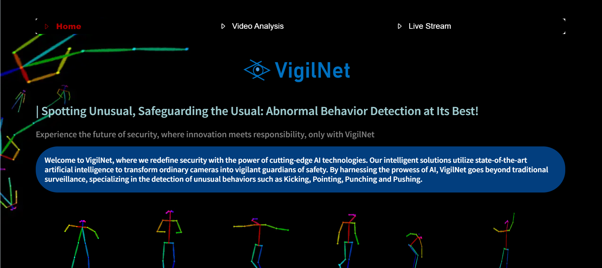
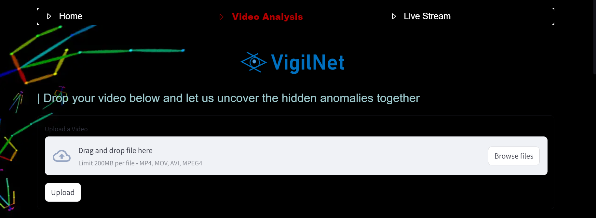
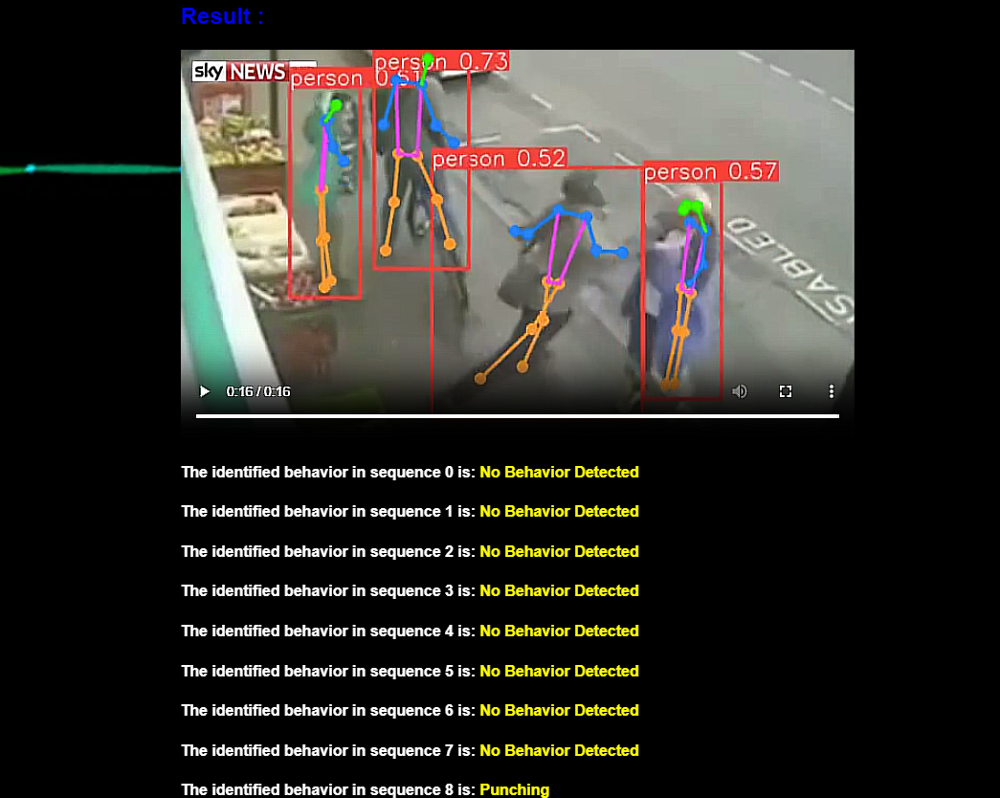

# abnormal_Behavior_Detection
The project "VigilNet" uses YOLOv8 for pose estimation and Conv3D for temporal analysis to detect abnormal behaviors in surveillance videos. Trained on the UT-Interaction dataset, it identifies anomalies in real-time. Integrated with Streamlit.
# Screenshots
 

